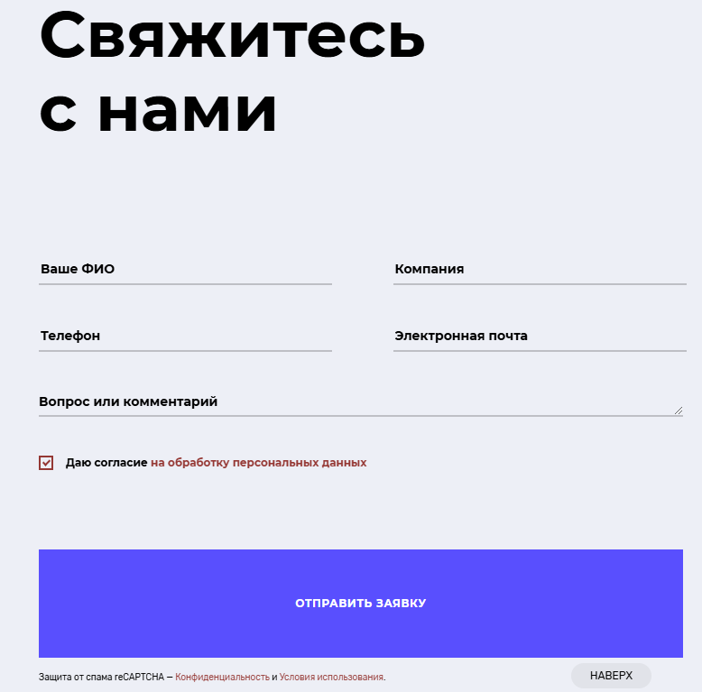

# АНАЛИЗ СОВРЕМЕННЫХ САЙТОВ

## ЛАБОРАТОРНАЯ РАБОТА №10 по дисциплине «Веб-технологии»

## **Выполнил**: Студент группы 241-672 Хатнянский Алексей Евгеньевич

# 1. Анализ сайтов и свойств
## 1.1 Подборка сайтов
1. **AGIMA**  
   - **Ссылка:** [agima.ru](https://www.agima.ru/)  
   - **Описание:** Студия специализируется на разработке сложных веб-сервисов и мобильных приложений.

2. **Notamedia**  
   - **Ссылка:** [nota.meida](https://nota.media/)  
   - **Описание:** Агентство, реализующее digital-решения для бизнеса.

3. **ADV**  
   - **Ссылка:** [adv.ru](https://adv.ru/)  
   - **Описание:** Создает промо-сайты, корпоративные порталы и CRM-системы.

4. **Extyl**  
   - **Ссылка:** [extyl-pro.ru](https://www.extyl-pro.ru/)  
   - **Описание:** Ориентирована на разработку e-commerce решений и крупных веб-сервисов.

5. **Студия Олега Чулакова**  
   - **Ссылка:** [chulakov.ru](https://chulakov.ru/)  
   - **Описание:** Занимается созданием премиум-дизайна и интерфейсов.

6. **ARTWELL**  
   - **Ссылка:** [artwell.ru](https://www.artwell.ru/)  
   - **Описание:** Разрабатывает веб-сайты с фокусом на юзабилити и адаптивный дизайн.

7. **КОРУС Консалтинг**  
   - **Ссылка:** [omni.korusconsulting.ru](https://omni.korusconsulting.ru/)  
   - **Описание:** Специализируется на создании B2B-платформ.

8. **Оджетто**  
   - **Ссылка:** [oggetto.ru](https://oggetto.ru/)  
   - **Описание:** Разработка лендингов и мультиязычных сайтов.

9. **ДАЛЕЕ**  
   - **Ссылка:** [dalee.ru](https://dalee.ru/)  
   - **Описание:** Упор на создание брендинговых решений и фирменного стиля.

10. **АЭРО**  
    - **Ссылка:** [aeroidea.ru](https://aeroidea.ru/)  
    - **Описание:** Работает над сайтами для медиа, спортивных и развлекательных проектов.

---

## 1.2 "Небанальные" CSS-свойства

1. **`aspect-ratio`**  
   - **Описание:** Устанавливает соотношение сторон для элемента.  
   - **Пример:**
    ```CSS
    aspect-ratio: 16 / 9;
    ```
   - **Применение:** Обеспечивает одинаковую пропорцию медиа-контента.

2. **`scroll-snap-type`**  
   - **Описание:** Контролирует прокрутку, фиксируя её на элементах.  
   - **Пример:**
    ```CSS
    scroll-snap-type: x mandatory;
    ```
   - **Применение:** Идеально для прокручиваний и галерей.

3. **`backdrop-filter`**  
   - **Описание:** Применяет фильтры к фону элемента. 
   - **Пример:**
    ```CSS
    backdrop-filter: blur(5px);
    ```
   - **Применение:** Создание эффекта размытия за полупрозрачными блоками.

4. **`clip-path`**  
   - **Описание:** Определяет область видимости элемента.  
   - **Пример:**
    ```CSS
    clip-path: circle(50%);
    ```
   - **Применение:** Создание нестандартных форм.

5. **`contain`**  
   - **Описание:** Оптимизирует производительность при рендеринге.  
   - **Пример:**
    ```CSS
    contain: layout;
    ```  
   - **Применение:** Подходит для отдельных компонентов.

6. **`scroll-behavior`**  
   - **Описание:** Устанавливает плавность прокрутки.  
   - **Пример:**
    ```CSS
   scroll-behavior: smooth;
   ```  
   - **Применение:** Создание более приятной навигации.

7. **`filter`**  
   - **Описание:** Применяет визуальные эффекты.  
   - **Пример:**
    ```CSS
    filter: grayscale(50%);
    ``` 
   - **Применение:** Улучшение изображений и текста.

8. **`overscroll-behavior`**  
   - **Описание:** Управляет поведением прокрутки на краях содержимого.  
   - **Пример:**
    ```CSS
    overscroll-behavior: none;
    ```
   - **Применение:** Предотвращения стандартного скролла.

9. **`object-fit`**  
   - **Описание:** Устанавливает способ заполнения содержимого внутри блока.  
   - **Пример:**
    ```CSS
    object-fit: cover;
    ```
   - **Применение:** Для масштабирования изображений в контейнерах.

10. **`isolation`**  
    - **Описание:** Управляет контекстом наложения.  
    - **Пример:**
     ```CSS
     isolation: isolate;
     ```  
    - **Применение:** Для предотвращения смешивания эффектов.


# 2. Структура сайта. Анализ структуры сайта АРТВЕЛЛ

### Ссылка на сайт: [АРТВЕЛЛ](https://www.artwell.ru/)

---

## Описание структуры

### HTML-структура (до 5 уровней вложенности)

#### Шапка (Header)
```html
<header class="header">
  <div class="header__logo">
    <a href="/" class="logo">АРТВЕЛЛ</a>
  </div>
  <nav class="header__nav">
    <ul class="nav__list">
      <li class="nav__item"><a href="/about" class="nav__link">О нас</a></li>
      <li class="nav__item"><a href="/services" class="nav__link">Услуги</a></li>
      <li class="nav__item"><a href="/contacts" class="nav__link">Контакты</a></li>
    </ul>
  </nav>
</header>
```

#### Основная часть (Main)
```html
<main class="main">
  <section class="hero">
    <div class="hero__text">
      <h1 class="hero__title">Мы создаем сайты</h1>
      <p class="hero__description">Digital-решения для вашего бизнеса</p>
    </div>
    <button class="hero__cta">Связаться с нами</button>
  </section>
</main>
```
#### Подвал (Footer)
```html
<footer class="footer">
  <div class="footer__info">
    <p class="footer__copyright">© 2025 АРТВЕЛЛ</p>
    <nav class="footer__nav">
      <ul class="footer__list">
        <li class="footer__item"><a href="/privacy" class="footer__link">Политика конфиденциальности</a></li>
      </ul>
    </nav>
  </div>
</footer>
```

## Характеристика структуры
1. **Методология именования классов**
   - **Используется БЭМ (Блок-Элемент-Модификатор):**
      - Блоки: header, hero, footer.
      - Элементы: header__logo, hero__title, footer__info.
      - Модификаторов в примере нет, но структура ясна и логична.

2. **HTML5-теги**  
   - **Используются стандартные семантические теги:**:
      - `<header>`, `<nav>`, `<main>`, `<section>`, `<footer>`.

3. **Обертки <div>**
   - **<div> используется только для группировки, чтобы структурировать содержимое:**
      - Например, `logo-container` и `footer-wrapper`.
   - Общее количество `<div>` минимально.

4. **Разбираемость кода**  
   - Классическая структура с четким разделением блоков.
   - Именование классов понятно, код читается легко.

## Свойства основных элементов
1. **Меню**
   - *Свойства:*
     - Меню фиксировано в верхней части страницы **(Всегда остается видимым при прокрутке.)**
```css
.header__nav {
    position: fixed;
    top: 0;
    width: 100%;
    background-color: white;
}
```
2. **Содержимое**
   - *Центрирование:*
      - Основное содержимое выровнено по центру благодаря:
```css
.main {
    width: 1020px;
    margin: 0 auto;
}
```
3. **Подвал**
   - *Центрироване:*
      - Элементы подвала выполненые в минималистичном дизайне, а также выровнены по центру с помощью:
```css
.footer__info {
    text-align: center;
}
```
# Скриншоты меню, основной части (содержимого) и подвала:
1. **МЕНЮ**
-4.png)

2. **ОСНОВНАЯ ЧАСТЬ**
-1.png>)

3. **ПОДВАЛ**

   -2.png)


# 3. Реализация блока. Сайт - [КОРУС](https://omni.korusconsulting.ru/) 
## HTML: Создание структуры формы заявки
### 1. **Определяем структуру документа HTML**
```html
<html lang="ru">
<head>
    <meta charset="UTF-8">
    <meta name="viewport" content="width=device-width, initial-scale=1.0">
    <title>Форма заявки</title>
    <link rel="stylesheet" href="contact-form.css">
</head>
<body>
    <!-- Контент будет здесь -->
</body>
</html>
```
### 2. **Создаем секцию формы**
Внутри тега <body> добавляем секцию, которая будет содержать форму. Указываем класс для стилизации:
```html
<section class="contact-form-section">
    <h1 class="form-title">
        Свяжитесь
        <br>
        с нами
    </h1>
```
### 3. **Создаем форму с полями ввода**
Используем тег `<form>`, чтобы организовать структуру с полями для ввода имени, компании, телефона, email и текста сообщения:
```html
    <form class="contact-form">
        <div class="form-row">
            <input type="text" name="name" placeholder="Ваше ФИО" class="form-input" required>
            <input type="text" name="company" placeholder="Компания" class="form-input company-input">
        </div>
        <div class="form-row">
            <input type="tel" name="phone" placeholder="Телефон" class="form-input" required>
            <input type="email" name="email" placeholder="Электронная почта" class="form-input email-input" required>
        </div>
        <div class="form-row">
            <textarea name="message" placeholder="Вопрос или комментарий" class="form-textarea"></textarea>
        </div>
        <div class="form-row checkbox-row">
            <label class="form-checkbox">
                <input type="checkbox" name="consent" required>
                <span class="checkbox-text">Даю согласие на обработку персональных данных</span>
            </label>
        </div>
        <div class="form-row">
            <button type="submit" class="form-submit-button">
                <span>Отправить заявку</span>
            </button>
        </div>
    </form>
```
### 4. **Добавляем footer с информацией**
Добавим ссылку на условия использования и политику конфиденциальности:
```html
    <p class="form-footer">
        Защита от спама reCAPTCHA — 
        <a href="#" class="footer-link">Конфиденциальность</a> и 
        <a href="#" class="footer-link">Условия использования</a>.
    </p>
</section>
```
## CSS: Стилизация формы
### 5. **Глобальные стили для страницы**
Определим основные стили для всего тела страницы, включая шрифт и фон:
```css
body {
    font-family: 'Arial', sans-serif;
    margin: 0;
    padding: 0;
    background-color: #e9ebf5;
    color: #333;
}
```
### 6. **Стили для секции формы**
Установим максимальную ширину, отступы и стили для фона формы:
```css
.contact-form-section {
    max-width: 800px;
    margin: 50px auto;
    padding: 40px;
    background-color: #f9faff;
    border-radius: 10px;
    box-shadow: 0 4px 10px rgba(0, 0, 0, 0.1);
}
```
### 7. **Стили для заголовка формы**
Настроим размер шрифта и выравнивание заголовка формы:
```css
.form-title {
    font-size: 2.5rem;
    font-weight: 700;
    margin-bottom: 10px;
    color: #222;
    text-align: left;
}

.form-title br {
    display: block;
}
```
### 8. **Стили для самой формы**
Организуем форму с помощью Flexbox для вертикального расположения элементов:
```css
.contact-form {
    display: flex;
    flex-direction: column;
    gap: 20px;
}
```
### 9. **Стили для полей ввода**
Определим размер полей ввода и их стили для фокуса:
```css
.form-input {
    flex: 1;
    min-width: 45%;
    padding: 10px 15px;
    border: none;
    border-bottom: 2px solid #ccc;
    font-size: 1rem;
    font-weight: 400;
    transition: border-color 0.3s ease;
}

.form-input:focus {
    border-color: #007bff;
    outline: none;
}
```
### 10. **Стили для текстового поля**
Создадим стиль для текстового поля с настройкой высоты и плавной анимацией:
```css
.form-textarea {
    width: 100%;
    padding: 10px 15px;
    border: 2px solid #ccc;
    border-radius: 5px;
    font-size: 1rem;
    resize: none;
    height: 120px;
    transition: border-color 0.3s ease;
}

.form-textarea:focus {
    border-color: #007bff;
    outline: none;
}
```
### 11. **Стили для чекбокса**
пределим стиль для чекбокса с изменением фона при его активации:
```css
.checkbox-row {
    display: flex;
    align-items: center;
}

.form-checkbox {
    display: flex;
    align-items: center;
    font-size: 1rem;
    gap: 10px;
    color: #666;
}

.form-checkbox input[type="checkbox"] {
    width: 18px;
    height: 18px;
    cursor: pointer;
    transition: background-color 0.3s ease;
}

.form-checkbox input[type="checkbox"]:checked {
    background-color: red; /* Красный цвет галочки */
}
```
### 12. **Стили для кнопки отправки**
Добавим стили для кнопки отправки с анимацией и эффектами при наведении:
```css
.form-submit-button {
    position: relative;
    width: 100%;
    padding: 15px;
    font-size: 1.5rem;
    font-weight: bold;
    color: #fff;
    background-color: #007bff;
    border: none;
    border-radius: 0px;
    cursor: pointer;
    overflow: hidden;
    transition: background-color 0.4s ease;
}

.form-submit-button span {
    position: relative;
    z-index: 2;
}

.form-submit-button::before {
    content: '';
    position: absolute;
    top: 0;
    left: -100%;
    width: 100%;
    height: 100%;
    background-color: #000;
    transition: left 0.4s ease;
}

.form-submit-button:hover::before {
    left: 0;
}

.form-submit-button:hover {
    background-color: #000;
}
```
### 13. **Стили для нижнего текста**
Настроим стили для ссылок и текста внизу формы:
```css
.form-footer {
    margin-top: 20px;
    font-size: 0.75rem;
    text-align: center;
    color: #666;
}

.footer-link {
    color: #007bff;
    text-decoration: none;
}

.footer-link:hover {
    color: red;
}
```
### 14. **Адаптивность для мобильных устройств**
Добавим стили для мобильных устройств:
```css
@media (max-width: 600px) {
    .form-input {
        min-width: 100%;
    }

    .form-row {
        flex-direction: column;
    }

    .form-submit-button {
        font-size: 1.25rem;
    }
}
```
### Итог: форма отправки заявок с вводом данных и комментариев, схожая с той, что находится на сайте [КОРУС](https://omni.korusconsulting.ru/)
## Сайт

## Созданная
-1.png>)


# 4. Ресурсы
### 1. [html5](https://html5book.ru/) - на данном ресурсе я изучаю книгу html5 book, благодаря которой подтягиваю свои базовые знания по вёрстке
### 2. [tuhub](https://tuhub.ru/categories/frontend) - на этом сайте я изучил flex и grid (если я что-то не помню по флексам и гридам, то я всегда захожу именно сюда)
### 4. [proglib](https://proglib.io/?tags%5B%5D=a1a14be3-fb53-463e-9fce-77cf85e5625e&page=1) - этот сайт меньший по посещению и использованию, но на нём часто можно научиться полезным лафхакам вёрстки
### 5. [Александр Ламков — Friendly Frontend](https://www.youtube.com/@AleksanderLamkov) - с этого канала началось моё обучение вёрстке. На этот канал я захожу чаще всего и стараюсь раз в неделю изучать новое в плейлистах для новичков.
### 6. [Aaron Jack](https://www.youtube.com/@AaronJack/videos) - данный канал используется в развлекательно-познавательных целях. Смотря ролики на этом канале, я подтягиваю свой английиский (в том числе в профессионально-неформальной сфере), а также узнаю актуальную информацию о мире программирования не только в своей стране, но и за рубежом
### 7. [Coding2GO](https://www.youtube.com/@coding2go/videos) - на этом ютуб канале я часто смотрю ролики для изучения верного синтаксиса html и css, а также узнаю полезные лайфхаки вёрстки
### 8. [Верстальщик от бога](t.me/godinhtml) - этот ТГ канал посоветовал преподаватель, поэтому по сей день я стараюсь следить за новостями, так как в этом канале часто публикуют полезные статьи и ресурсы, на которых можно, к примеру, изучить новые библиотекы CSS для улучшения своих анимаций и т.п.
### 9. [Веб-программист](https://vk.com/php2all) - на данное сообщество ВК я подписан давно. Чаще всего на нём публикуют мемы связанные с программированием, но своевременно в сообществе публикуются полезные видеоматериалы, которые я сохраняю в избранное и стараюсь раз в месяц просматривать некоторые из них.
### 10. [codepen](https://codepen.io/) - на этом сайте можно легко и быстро попрактиковаться или проработать определённую часть вёрстки, которую можно тут же протестировать. Сайт удобен тем, что тебе не нужно открывать отдельные программы, по типу VS, и создавать файл